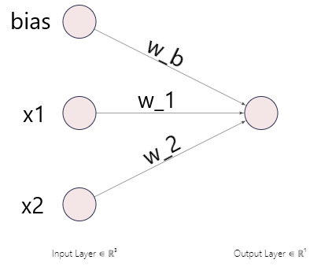

## Introduction

This post is yet another mini tutorial about MultiLayer Perceptron (MLP), backpropagation gradient techniques techniques. The percetion is the most important unit in a Neural Network. Understanding how this unit works, garantees the understanding a bigger Neural Network. We will describe the working a neuron in a MLP. The history why Artificial Neural Networks can be found everywhere online, but a great paper I would advise would be this one [Gradient-Based Learning Applied to Document Recognition](http://yann.lecun.com/exdb/publis/pdf/lecun-01a.pdf). 

The code is available here: [Simple Perceptron](https://github.com/juliennyambal/perceptron_analytics)

# Opening ...

<figure>
    
    <figcaption>Simple Perceptron</figcaption>
</figure>

A neuron is the most atomic element in an Artificial Neural Network (ANN). It has some properties:

### Input Nodes
The Input Nodes or Input matrix, are the static nodes in the networks. There are the ones feeding the network with the required inforamtion to perform the thinking. In the picture above it is represented by **x_1** and **x_2**. This makes our input set to be \mathbb{R}^2. For this example, we will simulate a couple logic gates which are AND, OR, XOR. The input set is as follows:

| bias    | x_1   | x_2 |
| ----- | ----- |-----|
| 1       | 0       |  0  |
| 1       | 0       |  1  |
| 1       | 1       |  0  |
| 1       | 1       |  1  |

You can notice the **bias** term in the first column. This is a very often neglected column. The preceptron is very much like a linear function centerd at *0* in a cartesian space without the bias. The perceptron without the bias would look like this y = w.T x X where y is the output vector, w is the weights vector and x is the input matrix. To ease the training, a bias term is added to the euqation above to make it more flexible: y = w.T x X + b where b is the bias term.

### Output Nodes
The output nodes are of the same size as the input nodes matrix, just in term of the number of rows or observations. This case the output nodes would be of size 4 since we have 4 observations. The full table would look like this: 

OR Gate
| bias    | x_1     | x_2   | y   |
| :-----: | :-----: |:-----:|:---:|
| 1       | 0       |  0    |0    |
| 1       | 0       |  1    |1    |
| 1       | 1       |  0    |1    |
| 1       | 1       |  1    |1    |

AND Gate
| bias    | x_1     | x_2   | y   |
| :-----: | :-----: |:-----:|:---:|
| 1       | 0       |  0    |0    |
| 1       | 0       |  1    |0    |
| 1       | 1       |  0    |0    |
| 1       | 1       |  1    |1    |

OR Gate
| bias    | x_1     | x_2   | y   |
| :-----: | :-----: |:-----:|:---:|
| 1       | 0       |  0    |0    |
| 1       | 0       |  1    |1    |
| 1       | 1       |  0    |1    |
| 1       | 1       |  1    |0    |

In this case the output node is made out of the column y.

### Weights
To Do

### Processing
To Do
#### Linear Combination Weights and Input Nodes
To Do
#### Activation Operation
To Do
